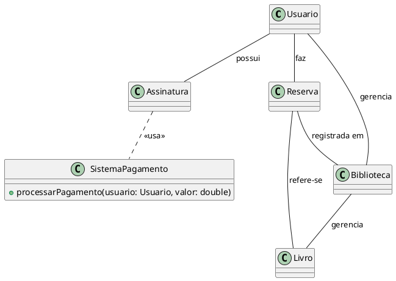

# Documento de Classes e Diagrama de Classe Conceitual

## Problema de Modelagem

Você foi contratado para desenvolver um sistema para gerenciar uma **biblioteca de livros digitais**. O sistema permitirá que os usuários façam login, procurem livros, reservem livros, e baixem cópias para leitura offline. A biblioteca também oferece assinatura premium, onde os usuários podem acessar livros exclusivos e ganhar vantagens especiais, como reservas antecipadas e downloads ilimitados.

## 1. Introdução

Este documento apresenta a modelagem conceitual das principais classes do sistema de gerenciamento de biblioteca de livros digitais, conforme os requisitos especificados. O objetivo é fornecer uma visão clara das entidades, seus atributos e relacionamentos, servindo de base para o desenvolvimento posterior.

## 2. Descrição das Classes

### Usuário

- **Atributos:**
    - `id`: int
    - `nome`: string
    - `email`: string
    - `senha`: string (criptografada)
    - `tipo_assinatura`: enum (BÁSICO, PREMIUM)
- **Métodos:**
    - `autenticar()`
    - `reservarLivro()`
    - `baixarLivro()`
    - `assinarPremium()`
    - `receberNotificacao()`

---

### Livro

- **Atributos:**
    - `id`: int
    - `titulo`: string
    - `autor`: string
    - `categoria`: string
    - `formato`: enum (PDF, EPUB)
    - `exclusivo`: bool
    - `disponivel`: bool
- **Métodos:**
    - `estaDisponivel()`
    - `reservar()`
    - `baixar()`

---

### Reserva

- **Atributos:**
    - `id`: int
    - `usuario`: Usuário
    - `livro`: Livro
    - `data_reserva`: datetime
    - `data_expiracao`: datetime
    - `status`: enum (ATIVA, EXPIRADA, CONCLUÍDA)
- **Métodos:**
    - `verificarExpiracao()`
    - `concluirReserva()`

---

### Assinatura

- **Atributos:**
    - `id`: int
    - `usuario`: Usuário
    - `data_inicio`: datetime
    - `data_fim`: datetime
    - `status`: enum (ATIVA, EXPIRADA)
- **Métodos:**
    - `renovar()`
    - `cancelar()`

---

### Notificacao

- **Atributos:**
    - `id`: int
    - `usuario`: Usuário
    - `mensagem`: string
    - `data_envio`: datetime
    - `lida`: bool
- **Métodos:**
    - `marcarComoLida()`

---

### Pagamento

- **Atributos:**
    - `id`: int
    - `usuario`: Usuário
    - `valor`: float
    - `data_pagamento`: datetime
    - `status`: enum (PENDENTE, APROVADO, RECUSADO)
- **Métodos:**
    - `processarPagamento()`

## 3. Relacionamentos

- Um **Usuário** pode ter várias **Reservas** e várias **Assinaturas**.
- Um **Livro** pode estar associado a várias **Reservas**.
- Uma **Reserva** está associada a um único **Usuário** e um único **Livro**.
- Um **Usuário** pode receber várias **Notificações**.
- Um **Usuário** pode realizar vários **Pagamentos**.

## 4. Diagrama de Classe Conceitual (UML)

+----------------+        +----------------+        +----------------+
|    Usuário     |<>-----o|    Reserva     |o-----<>|     Livro      |
+----------------+        +----------------+        +----------------+
| id             |        | id             |        | id             |
| nome           |        | data_reserva   |        | titulo         |
| email          |        | data_expiracao |        | autor          |
| senha          |        | status         |        | categoria      |
| tipo_assinatura|        +----------------+        | formato        |
+----------------+                                 | exclusivo      |
| autenticar()   |                                 | disponivel     |
| reservarLivro()|                                 +----------------+
| baixarLivro()  |                                 | estaDisponivel()|
| assinarPremium()|                                | reservar()      |
| receberNotif() |                                 | baixar()        |
+----------------+                                 +----------------+
      | 1                                         1|      *
      |                                            |
      | *                                          |
+----------------+                                 |
|  Assinatura    |                                 |
+----------------+                                 |
| id             |                                 |
| data_inicio    |                                 |
| data_fim       |                                 |
| status         |                                 |
+----------------+                                 |
| renovar()      |                                 |
| cancelar()     |                                 |
+----------------+                                 |
      | 1                                          |
      | *                                          |
+----------------+                                 |
|  Notificacao   |                                 |
+----------------+                                 |
| id             |                                 |
| mensagem       |                                 |
| data_envio     |                                 |
| lida           |                                 |
+----------------+                                 |
| marcarComoLida()|                                |
+----------------+                                 |
      | 1                                          |
      | *                                          |
+----------------+                                 |
|   Pagamento    |                                 |
+----------------+                                 |
| id             |                                 |
| valor          |                                 |
| data_pagamento |                                 |
| status         |                                 |
+----------------+                                 |
| processarPag() |                                 |
+----------------+                                 |

## 5. Observações

- O diagrama acima é conceitual e pode ser refinado na modelagem lógica/física.
- As regras de negócio, como limites de reserva e acesso a livros exclusivos, são implementadas nos métodos das classes e validadas conforme o tipo de assinatura do usuário.
- A integração com o sistema de pagamento ocorre via classe **Pagamento**.

