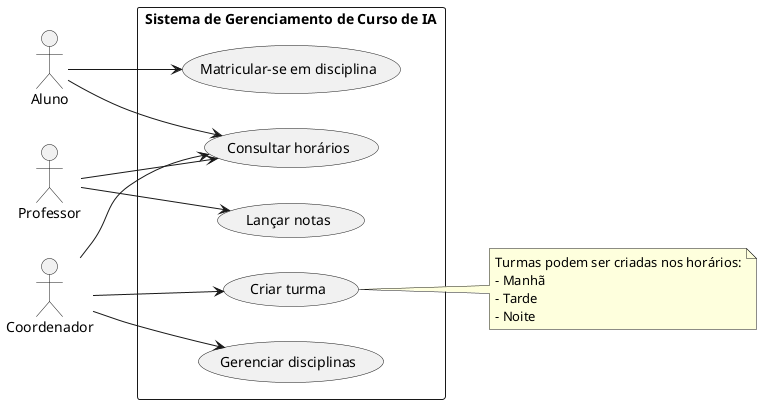

### Matricular-se em disciplina

- **Atores:**
  - Aluno
  - Sistema

- **Pré-Condições:**
  - O aluno deve estar cadastrado e autenticado no sistema.
  - A disciplina deve estar disponível para matrícula.

- **Fluxo Básico:**
  1. Aluno acessa a funcionalidade de matrícula.
  2. Sistema exibe lista de disciplinas disponíveis.
  3. Aluno seleciona a disciplina desejada.
  4. Sistema verifica disponibilidade de vagas.
  5. Sistema realiza a matrícula do aluno na disciplina.
  6. Sistema confirma a matrícula ao aluno.

- **Fluxos Alternativos:**
  - 4a. Não há vagas disponíveis na disciplina.
	- 4a1. Sistema exibe mensagem informando indisponibilidade.
  - 3a. Aluno tenta se matricular em disciplina com conflito de horário.
	- 3a1. Sistema exibe mensagem de conflito e impede matrícula.

### Lançar notas

- **Atores:**
  - Professor
  - Sistema

- **Pré-Condições:**
  - Professor deve estar autenticado.
  - Professor deve estar vinculado à turma/disciplina.

- **Fluxo Básico:**
  1. Professor acessa a funcionalidade de lançamento de notas.
  2. Sistema exibe lista de turmas/disciplina do professor.
  3. Professor seleciona turma/disciplina.
  4. Sistema exibe lista de alunos.
  5. Professor insere notas dos alunos.
  6. Sistema salva e confirma o lançamento das notas.

- **Fluxos Alternativos:**
  - 5a. Nota inserida fora do intervalo permitido.
	- 5a1. Sistema exibe mensagem de erro e solicita correção.
  - 2a. Professor não possui vínculo com turma/disciplina.
	- 2a1. Sistema exibe mensagem de acesso negado.

### Criar turma

- **Atores:**
  - Coordenador
  - Sistema

- **Pré-Condições:**
  - Coordenador deve estar autenticado.
  - Disciplinas devem estar cadastradas.

- **Fluxo Básico:**
  1. Coordenador acessa a funcionalidade de criação de turma.
  2. Sistema exibe lista de disciplinas disponíveis.
  3. Coordenador seleciona disciplina e horário (manhã, tarde ou noite).
  4. Sistema verifica disponibilidade de sala e horário.
  5. Sistema cria a turma e associa à disciplina.
  6. Sistema confirma a criação da turma ao coordenador.

- **Fluxos Alternativos:**
  - 4a. Não há disponibilidade de sala no horário escolhido.
	- 4a1. Sistema exibe mensagem de indisponibilidade e solicita novo horário.
  - 2a. Nenhuma disciplina cadastrada.
	- 2a1. Sistema exibe mensagem de erro.

### Consultar horários

- **Atores:**
  - Aluno
  - Professor
  - Coordenador
  - Sistema

- **Pré-Condições:**
  - Usuário deve estar autenticado.

- **Fluxo Básico:**
  1. Usuário acessa a funcionalidade de consulta de horários.
  2. Sistema exibe os horários das turmas/disciplina vinculadas ao usuário.
  3. Usuário visualiza os horários.

- **Fluxos Alternativos:**
  - 2a. Usuário não possui vínculo com nenhuma turma/disciplina.
	- 2a1. Sistema exibe mensagem informando ausência de horários.

### Gerenciar disciplinas

- **Atores:**
  - Coordenador
  - Sistema

- **Pré-Condições:**
  - Coordenador deve estar autenticado.

- **Fluxo Básico:**
  1. Coordenador acessa a funcionalidade de gerenciamento de disciplinas.
  2. Sistema exibe lista de disciplinas cadastradas.
  3. Coordenador pode cadastrar, editar ou remover disciplinas.
  4. Sistema salva as alterações e confirma ao coordenador.

- **Fluxos Alternativos:**
  - 3a. Coordenador tenta remover disciplina vinculada a turma ativa.
	- 3a1. Sistema impede remoção e exibe mensagem de erro.

## Casos de Uso

### Criação de uma conta no sistema

* Atores:

	- Usuário
	- Sistema

- Pré-Condições:
	- Nenhuma

* Fluxo Básico:
    1. Usuário fornece e-mail, senha e confirmações
    2. Dados do Usuário são validados pelo Sistema
    3. Dados do Usuário são encriptados pelo Sistema
    4. Dados do Usuário são persistidos pelo Sistema
    5. Sistema gera um link com prazo de expiração
    6. Sistema envia e-mail de verificação, com o link, para o Usuário
    7. Usuário confirma o e-mail antes do link expirar
    8. Sistema confirma que o Cadastro do Usuário foi realizado com sucesso
    9. Sistema redireciona o Usuário para a página de Entrada

- Fluxos Alternativos:
	- 2a. E-mail do Usuário é inválido
		2a1. Sistema exibe mensagem de erro
	- 2b. Senha do Usuário não respeita regras de segurança
		- 2b1. Sistema exibe mensagem de erro
	- 3a. Usuário tenta confirmar o e-mail depois de o link expirar
		- 3a1. Sistema sugere que o Usuário realize um novo Cadastro

### Entrada do usuário no sistema

- Atores:
	- Usuário
	- Sistema

- Pré-Condições:
	Usuário deve estar cadastrado

- Fluxo Básico:
    - 1. Usuário fornece e-mail e senha
	- 2. Sistema autentica o Usuário
	- 3. Sistema redireciona o Usuário para a página inicial

- Fluxos Alternativos:
	- 2a. Dados do Usuário Inválidos
		- 2a1. Sistema exibe mensagem de erro
	- 3a. Primeio acesso do Usuário
		- 3a1. Sistema redireciona o Usuário para a página de edição de perfil
