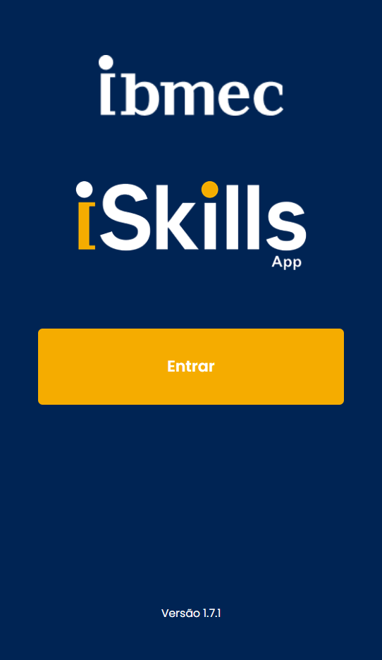

---
hide:
  - navigation
  - toc
---  

# PBE_25.2_8002

-   :material-github:{ .lg .right } __PBE_25.2_8002_I__

    ---

    Ana Clara, Caio Azevedo, João Pedro, Keanu Pereira, .

    [:octicons-arrow-right-24: Repositório](https://github.com/Projetos-de-Extensao/PBE_25.2_8002_I)

-   :material-github:{ .lg .middle } __PBE_25.2_8002_II__

    ---

    Enzo Zambrotti, Felipe, Murilo Piatigorsky, Nicholas Victorino
    
    [:octicons-arrow-right-24: Repositório](https://github.com/Projetos-de-Extensao/PBE_25.2_8002_II)

-   :material-github:{ .lg .middle } __ISkills__

    ---
    

      
    

